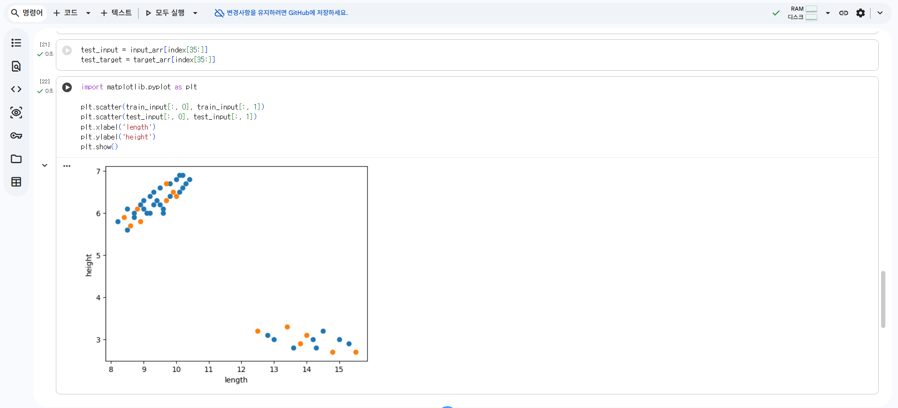
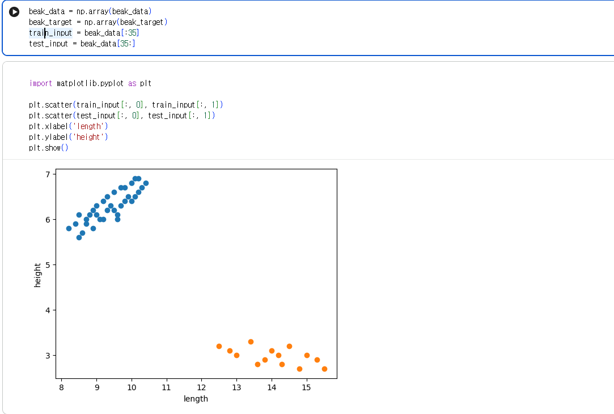
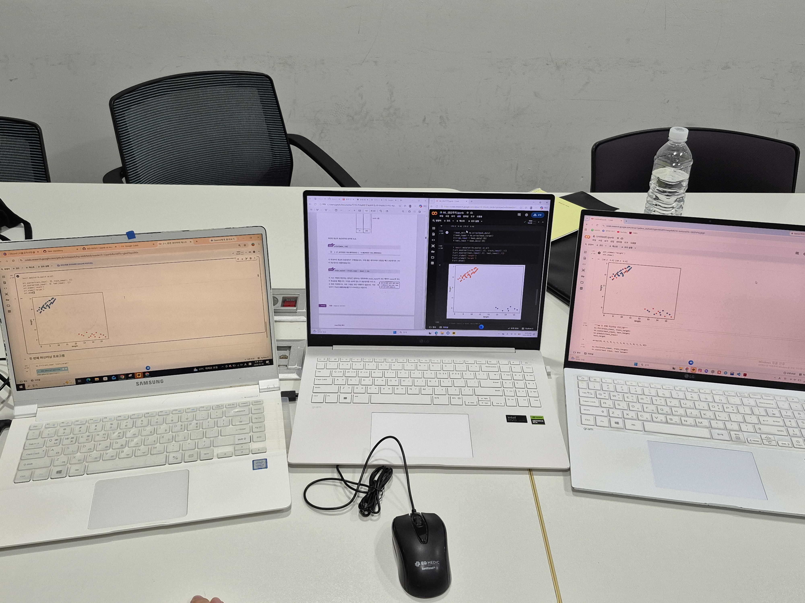
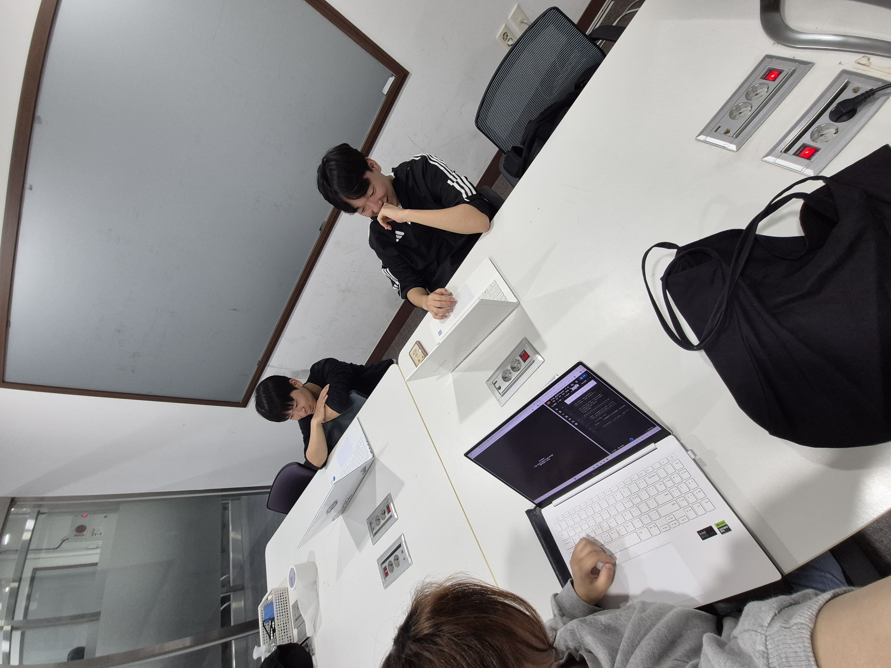

# 🦎 ML 기초 스터디 2주차 기록

갈라파고스 핀치 부리 데이터로 머신러닝 기초를 배우면서, 생긴 궁금증을 AI에게 물어보고 정리한 노트입니다.
역시 **가볍게, 배운 내용을 설명하는 느낌**으로 적었습니다.

## 📖 배운 내용

### 1. 특성과 학습

- **특성(Feature)**: 데이터를 표현하는 성질 → 부리 폭, 부리 길이 2개
- **학습(fit)**: 데이터에서 규칙을 찾는 과정 → 사이킷런의 `fit()`
- **모델(Model)**: 알고리즘이 구현된 객체 → 이번엔 `knn` 변수

### 2. 지도 학습 vs 비지도 학습

- **지도 학습**: 입력 + 정답을 줘서 배우고, 새로운 걸 예측 → KNN이 여기 해당
- **비지도 학습**: 정답이 없음 → 예측이 아니라 데이터에서 패턴을 찾음

### 3. 훈련 세트 vs 테스트 세트

- **훈련 세트**: 배우게 쓰는 데이터. 클수록 좋음
- **테스트 세트**: 한 번도 안 본 데이터. 실력을 재는 용도
- 보통 전체의 20\~50%를 테스트 세트로 둠

### 4. k-최근접 이웃 (KNN)

- **가장 간단한 알고리즘 중 하나**
- 규칙을 미리 만드는 게 아니라, **전체 데이터를 그냥 메모리에 들고 있는 것**이 전부
- 가장 가까운 k개를 찾아서, 더 많은 쪽으로 답을 정함
- 이웃 수는 보통 **홀수(3, 5, 7)** → 여러 값으로 바꿔보며 정확도 좋은 걸 고름

### 5. 정확도

- `정확도 = 맞힌 개수 / 전체 개수`
- 사이킷런은 0\~1 사이 값으로 줌

```python
pred = knn.predict(test_input)
accuracy = np.mean(pred == test_target)
print(accuracy)
```

### 6. 데이터 전처리

- 모델에 넣기 전에 가공하는 단계. **전체 공정 중 시간이 제일 오래 걸림**
- **표준점수**: 평균 빼고 표준편차로 나눠서 스케일을 맞춰줌

- ⚠️ 테스트 세트는 **반드시 훈련 세트의 평균·표준편차로** 바꿔야 함
- **브로드캐스팅**: 크기가 다른 numpy 배열끼리 자동으로 사칙연산 해줌

## 🧰 사용해야 할 함수

- **numpy** — `np.array()` (리스트→배열), `np.arange()` (간격 배열), `np.random.seed()` (같은 난수 재현)
- **matplotlib** — `plt.scatter()` (산점도), `c=` 로 색 지정, 지정 안 하면 기본 10색
- **scikit-learn** — `train_test_split()` (훈련/테스트 분리), `KNeighborsClassifier()` (KNN 모델), `kneighbors()` (가까운 이웃 찾기)
- `stratify` 는 양쪽 비율을 맞춰서 나눠주는 옵션

## 🔬 실습: 갈라파고스 핀치 부리



부리 폭/길이 49마리 데이터를 **0\~34번(35마리)** 과 **35\~48번(14마리)** 두 그룹으로 나눠봤습니다.

- 특성1. **beak_height** : 부리의 폭
- 특성2. **beak_length** : 부리의 길이
- **A섬 핀치** - 부리의 폭이 작고 길다.
- **B섬 핀치** - 부리의 폭이 크고 짧다.

```python
import numpy as np
import matplotlib.pyplot as plt

beak_data = np.array(beak_data)
beak_target = np.array(beak_target)

train_input  = beak_data[:35]     # 0~34번
test_input   = beak_data[35:]     # 35~끝
train_target = beak_target[:35]
test_target  = beak_target[35:]

plt.scatter(train_input[:, 0], train_input[:, 1], c="blue")     # 훈련
plt.scatter(test_input[:, 0],  test_input[:, 1],  c="orange")   # 테스트
plt.xlabel("beak_length")
plt.ylabel("beak_height")
plt.show()
```



파란 점은 위쪽에, 주황 점은 아래쪽에 나뉘어 보입니다.

## 🤖 AI에게 물어본 궁금증

### Q1. `train` 철자만 바꿨는데 왜 그래프가 완전히 달라졌을까?

`train_input`을 실수로 `trian_input`이라고 쳤다가 고쳤더니, **파란 점 35개가 사라지고 주황색만 남았습니다.**


- 오타는 **새 변수를 하나 만드는 것**일 뿐, 원래 있던 `train_input`은 그대로 남아 있음
- 노트북은 실행한 셀이 **끝까지 살아 있어서**, 옛날 값이 메모리에 남아 있었음
- 그래서 plt가 **옛날 값(14마리)** 을 그대로 그림

```text
trian_input 친 상태
  파란(옛날 값) → 아래쪽 14마리
  주황(새 값)   → 위쪽 35마리
  → 위치가 다름 → 둘 다 보임
```


```python
train_input = beak_data[:35]   # 이제 진짜 갱신됨 → 35마리
test_input  = beak_data[:35]   # ⚠️ 여기는 여전히 [:35]
```

- 둘 다 **똑같은 35마리**가 돼서 파란 점 위에 주황 점이 덮어버림
- **지워진 게 아니라 가려진 것.** 나중에 그려진 주황 점이 파란 점을 덮은 것
- **해결: `test_input = beak_data[35:]`**

> `:35` 를 두 줄에 똑같이 써서 겹친 거였음

### Q2. 파란 점이 14개인데 왜 8개로만 보일까?

- 점은 사라진 게 아니라 **좌표가 비슷해서 겹쳐 보이는 것**
- `scatter()`는 좌표가 비슷한 위치에 계속 덮어씌움
- 49줄 다 비교해봤는데 **완전히 같은 행은 0개**. 0.1\~0.2 차이로 매우 가까워서 그런 것
- 점을 키우고 투명도를 낮추면 겹친 점이 보임

```python
plt.scatter(x, y, s=60, alpha=0.6)
```

### Q3. 노트북은 왜 위에서 아래로 실행하는 게 아닌가요?

> 1.같은 변수명을 여러 번 쓰다 보니 그렇게 실행됨.

> 2.아래 코드 돌려놓은 게 위쪽에도 영향 미치니깐 헷갈리지 않게 잘 작성해야 함.

> 3.또한 변수명을 여러번 쓰다 보면 오류가 날 수 있음.(코렙의 경우, 아래 코드 실행하면 위쪽에도 영향을 미치기 때문에 주의필요!!)

**이게 AI의 생각입니다.** `.py` 파일이 아니라 노트북이라서 그렇게 나온 겁니다.

| | `.py` 파일 | Jupyter / 콜랩 |
|---|---|---|
| 실행 | 위에서 아래로 한 번에 | 셀 단위로 원하는 것만 |
| 변수 | 끝나면 전부 사라짐 | 마지막 셀까지 계속 살아 있음 |
| 위 셀 재실행 | 해당 줄부터 다시 계산 | 실행 안 한 셀은 그대로 |

- 같은 변수 여러 번 쓰면 **"어느 실행 결과가 남아 있는지" 추적이 어려움**
- 노트북을 남길 때는 **"모두 실행"으로 위에서부터 한 번에 돌려보는 게** 중요


## 📸 스터디 현장





## 📝 한 줄 회고

변수를 **"데이터를 담는 상자"** 로만 생각했는데, 실제로는 **메모리 객체를 가리키는 이름표**라는 걸 이번에 체감했습니다. 철자 오타 하나로 그래프가 통째로 바뀐 경험 때문에, 이제는 변수 하나하나가 뭘 담고 있는지 의식하게 될 것 같습니다.

---

*이 노트는 GitHub Pages로 공유한 기록입니다.*

